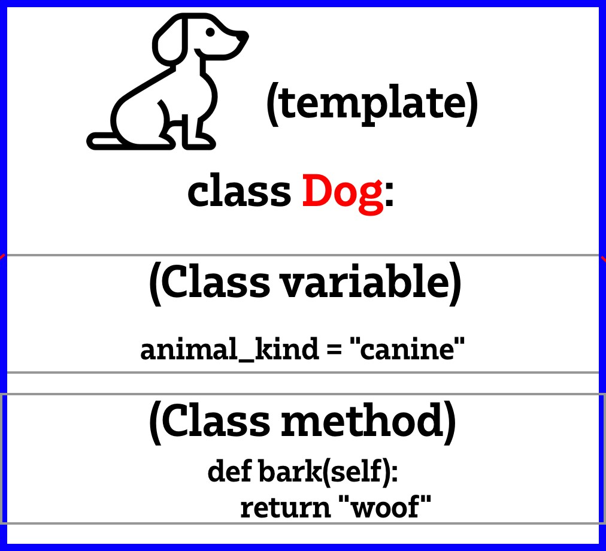

# OOP - Object oriented Programming

Turning code into objects which can then be manipulated. The name of a class should be capitalized and camel case.

A class variable is a variable in the scope of the class. Not a global variable. Class functions are called methods.

When you create a class it is like a blueprint or template. 

Class creation example:
```python
class Dog:

    animal_kind = "canine" # class variable

    def bark(self): # class function = methods
        print(self.animal_kind)
        return "woof"
```

`self` refers to the current class so in this case it is Dog.



### Instantiation 

This means to create an instance of the class. So for the example you will make a dog using the template.

```python
fido = Dog()
lassie = Dog()
```

The type of fido is `<class '__main__.Dog'>`. A class. So fido and lassie have access to the same methods and variables that Dog() has. They are separate entities.


Class variables **can** be overwritten.
Be careful of class variables. 


## The four pillars of OOP

1. Encapsulation -> Classes are self-contained, hiding details from users.
2. Abstraction -> You don't always need to know how something works to use it.
3. Inheritance -> Inherit the variables and methods from the parent class.
4. Polymorphism -> 

To create a child from a class you can pass the child the parent class as a parameter. 
example:
```python
class Reptile(Animal):

    super().__init__()
```

The `super()` initialises the parent class - inherit everything from animal when you create reptile.